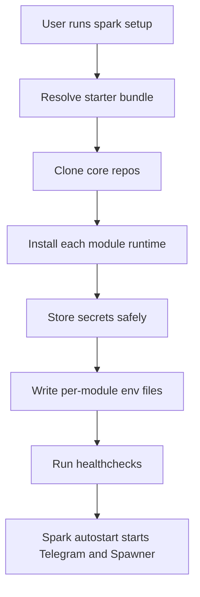
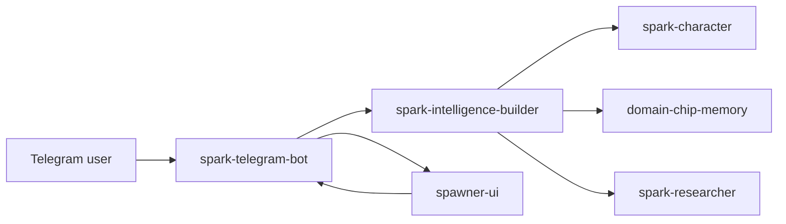

# spark-cli

Local installer and operator CLI for the Spark module ecosystem. A single setup command installs the starter stack, stores secrets, wires module env, runs healthchecks, and keeps long-running modules under supervision.

The public launch stack is documented in [docs/SPARK_ECOSYSTEM_LAUNCH.md](./docs/SPARK_ECOSYSTEM_LAUNCH.md).

## Quick Start

On any machine with Python 3.11+, git on PATH, and Node.js >=22:

Ubuntu/Debian minimal installs may need Python venv support before the direct pip path:

```bash
sudo apt update
sudo apt install -y python3-venv
```

The shell installer downloads a managed Node runtime automatically. If you use the direct pip path, verify `node --version` reports v22 or later before setup:

```bash
git clone https://github.com/vibeforge1111/spark-cli
cd spark-cli
pip install -e .

spark setup
spark autostart on --now
spark status
```

That default setup installs:

- `spark-harness-core`
- `spark-researcher`
- `spark-character`
- `spark-intelligence-builder`
- `domain-chip-memory`
- `spawner-ui` (the upstream repo for this module is `vibeforge1111/vibeship-spawner-ui` -- historical rename; the module key, directory name, and bundle reference stay `spawner-ui`)
- `spark-telegram-bot`

Voice is available as an opt-in starter path:

```bash
spark setup --with-voice
```

or directly:

```bash
spark setup telegram-voice-starter
```

Add `--elevenlabs-api-key @clipboard` if you want hosted ElevenLabs TTS configured during setup. The key is stored in Spark secrets and injected into Builder at runtime; it is not written into Telegram config.

Public builder labs such as `spark-domain-chip-labs` and `spark-personality-chip-labs` are available separately, but they are not automatic starter-bundle modules yet. Spark Swarm Workspace/network submission is private/upcoming and is not required for local recursive Builder chip loops.

The current installer proof lane covers 11 canonical repos: `spark-cli` plus the 10 registry-pinned runtime/support modules. The plain `telegram-starter` bundle exercises Harness Core, Researcher, Character, Builder, Memory, Spawner, and Telegram directly. `telegram-voice-starter`, QA Evidence Lane, and Skill Graphs require their own optional-module proof before claiming the entire 11-repo lane is ship-ready.

For creator-system and specialization-path work, verify those optional surfaces explicitly:

```bash
spark verify --specialization-loop
```

That check looks for `spark-domain-chip-labs`, `spark-swarm`, and at least one usable `specialization-path-*` root. If they are not installed as Spark modules yet, set `SPARK_DOMAIN_CHIP_LABS_ROOT`, `SPARK_SWARM_ROOT`, and `SPARK_SPECIALIZATION_PATH_ROOTS` to the local repo paths before running it.

If another `spark` binary is already on your PATH, use `spark-local`. The package exposes both names to the same entrypoint.

## What Spark CLI Does

Spark CLI is the installer and operator shell for the Spark ecosystem. It gives a normal user one path instead of several separate repo installs.

Spark runs an autonomous agent on your machine. Before granting access, read [SECURITY.md](./SECURITY.md) for the plain-language privacy, access-model, and telemetry disclosure: what is stored locally under `~/.spark/`, what the agent can read/write/run at each access level, and the fact that Spark has no usage telemetry or phone-home.



The CLI owns:

- module discovery and install records
- safe secret storage
- generated module env files
- managed Python/Node runtime shims where needed
- healthchecks, logs, start/stop, and update flows

The CLI does not own:

- Telegram bot behavior
- Builder memory policy
- Spawner mission execution
- domain-chip benchmark logic

## Requirements

| Dependency | Why |
|---|---|
| Python 3.11+ | The CLI itself |
| Node.js >=22 | Required by starter modules when using the direct pip install path. The shell installer can download a managed Node automatically. |
| `git` on PATH | To clone git-sourced modules and pull updates |
| OS keychain | Windows Credential Manager, macOS Keychain, or libsecret for `storage = "keychain"` secrets. Falls back to a mode-0600 file when no keychain is available. |

Per-module runtimes are declared in each module's `spark.toml`. The installer checks runtime constraints before running install commands. Pass `--skip-runtime-check` only for sandbox smoke tests.

## Install The CLI

Recommended macOS/Linux/WSL install. The shell installer auto-detects Apple Silicon, Intel Mac, Linux x64, Linux arm64, and WSL before downloading the managed Node runtime:

```bash
curl -fsSLO https://raw.githubusercontent.com/vibeforge1111/spark-cli/master/scripts/install.sh
less install.sh
bash ./install.sh
```

Recommended Windows PowerShell install:

```powershell
iwr https://raw.githubusercontent.com/vibeforge1111/spark-cli/master/scripts/install.ps1 -OutFile .\install.ps1
Get-Content .\install.ps1
powershell -ExecutionPolicy Bypass -File .\install.ps1
```

Windows scripted setup can pass the normal onboarding values directly to the installer:

```powershell
powershell -ExecutionPolicy Bypass -File .\install.ps1 `
  -NonInteractiveSetup `
  -BotToken $env:TELEGRAM_BOT_TOKEN `
  -AdminTelegramIds $env:TELEGRAM_ADMIN_IDS `
  -LlmProvider openai
```

The Windows installer adds `~\.spark\bin` to your user PATH so a new CMD or PowerShell can run `spark status` directly. If the current terminal still finds another `spark.exe`, reopen it or use the direct wrapper path: `%USERPROFILE%\.spark\bin\spark.cmd status`.

The launch docs intentionally avoid piping remote scripts directly into a shell. The installer also verifies the managed Node archive against Node's published `SHASUMS256.txt` before extraction.
If a good Node/npm is already installed, the installer uses it to avoid a slow first-run download; pass `-ManagedNode` on Windows or `--managed-node` on macOS/Linux to force Spark's verified managed Node runtime.
Before deploying installer changes, verify the committed script manifest locally with `spark verify --installers`. After deploying `agent.sparkswarm.ai`, run `spark verify --installers --hosted-installers` to catch stale hosted copies, stale hosted checksums, stale `/install/commands.json`, and stale `/install/release-manifest.json`.
For production pushes, use the full gate in [docs/LAUNCH_RUNBOOK.md](./docs/LAUNCH_RUNBOOK.md) so installer, sandbox, hosted, and paired-repo checks ship together.

In an interactive terminal, the macOS/Linux/WSL installer starts the Telegram starter stack and installs the operating-system login hook by default. In unattended runs (`--yes`, piped stdin, CI, or another non-TTY shell), the installer defaults to `--no-autostart` so upgrades do not silently mutate login items. Use `--autostart` only when that mutation is intentional, or run `spark autostart on --now` later. Run `spark fix autostart` if login startup is missing, stale, or points at an old Spark home.

For scripted setup:

```bash
bash ./install.sh \
  --yes \
  --non-interactive-setup \
  --no-autostart \
  --bot-token "$TELEGRAM_BOT_TOKEN" \
  --admin-telegram-ids "$TELEGRAM_ADMIN_IDS"
```

That command installs and wires the starter stack, but it intentionally does not invent an LLM provider. If no provider is chosen, `spark status` and `spark fix telegram` report the LLM roles as not configured instead of silently falling back to a local model.

To wire LLMs during setup, run interactive `spark setup` and choose from the provider menu. The wizard first asks for Telegram/BotFather values, then asks which default LLM provider should power Agent and Mission. Agent covers Telegram chat, runtime reasoning, memory, and recall. Mission covers Spawner/Mission Control builds, research, coding, and longer tracked work. Setup only asks for the key the selected provider actually needs, and users can split Agent and Mission during setup if they already know they want different providers.

Spark supports the same onboarding shape on Windows, macOS, Linux, and WSL:

```bash
bash ./install.sh \
  --yes \
  --non-interactive-setup \
  --no-autostart \
  --bot-token "$TELEGRAM_BOT_TOKEN" \
  --admin-telegram-ids "$TELEGRAM_ADMIN_IDS" \
  --llm-provider openai
```

Provider options:

| Provider | Good first path | Key-based path |
|---|---|---|
| OpenAI | Sign in with `codex`, then run `spark setup --llm-provider openai` | `spark setup --llm-provider openai --openai-api-key <OPENAI_API_KEY>` |
| Codex CLI | Sign in with `codex`, then run `spark setup --llm-provider codex` | Uses the signed-in Codex CLI, no API key flag |
| Anthropic | Sign in with `claude`, then run `spark setup --llm-provider anthropic` | `spark setup --llm-provider anthropic --anthropic-api-key <ANTHROPIC_API_KEY>` |
| OpenRouter | Use an OpenRouter key and model id | `spark setup --llm-provider openrouter --openrouter-api-key <OPENROUTER_API_KEY> --openrouter-model <MODEL>` |
| Z.AI / GLM | Use the coding endpoint key | `spark setup --llm-provider zai --zai-api-key <ZAI_API_KEY>` |
| MiniMax | Use a MiniMax API key | `spark setup --llm-provider minimax --minimax-api-key <MINIMAX_API_KEY>` |
| Hugging Face router | Use a Hugging Face token and chat model id | `spark setup --llm-provider huggingface --huggingface-api-key <HF_TOKEN> --huggingface-model <MODEL>` |
| Ollama | Start Ollama locally | `spark setup --llm-provider ollama --ollama-url http://localhost:11434 --ollama-model <MODEL>` |

If your terminal will not paste secrets, copy the key normally and type `@clipboard` instead of the key:

```bash
spark setup --llm-provider zai --zai-api-key @clipboard --resume
```

The same shortcut works for BotFather tokens and generic secrets, for example `spark setup --bot-token @clipboard --resume`.
If a shell cannot paste secrets cleanly, put the value in an environment variable and reference it without printing it:

```bash
spark setup --bot-token @env:TELEGRAM_BOT_TOKEN --admin-telegram-ids "$TELEGRAM_ADMIN_IDS"
```

Rerunning setup is meant to be a fast configuration refresh. If the starter stack is already installed, `spark setup --resume` reuses the installed modules and skips `pip`/`npm` dependency commands by default, so your terminal stays responsive. To intentionally repair or reinstall dependencies, run:

```bash
spark setup --resume --run-install-commands
```

### Optional Memory Sidecars

The default memory install stays conservative: `domain-chip-memory` is active, and external sidecars are off. To opt into the local Graphiti/Kuzu shadow lane for persistent-memory evaluation, run:

```bash
spark setup --resume --memory-sidecars graphiti-kuzu
```

This writes Builder config for `spark.memory.sidecars.graphiti.*`, installs `domain-chip-memory[graphiti-kuzu]` unless `--skip-install-commands` is present, and keeps current-state/entity-state memory authoritative until the sidecar has evidence.

To install Spark with Telegram voice onboarding, run:

```bash
spark setup --with-voice
```

For hosted ElevenLabs voice during setup:

```bash
spark setup --with-voice --elevenlabs-api-key @clipboard
```

After setup, open Telegram and send `/voice self-test`. Then say `Guide me through ElevenLabs voice setup` or `I care more about local/private`.

Use `--memory-sidecars none` to explicitly disable the optional Graphiti sidecar profile.

By default, one provider powers everything:

```bash
spark setup --llm-provider zai --zai-api-key @clipboard
```

That configures Agent and Mission together. Agent includes conversation, Spark reasoning/runtime, memory, and recall. Mission covers Spawner builds and longer-running work.

For more control, split Agent and Mission providers:

```bash
spark setup --resume \
  --agent-llm-provider zai \
  --mission-llm-provider codex
```

For expert control, set the internal providers directly:

```bash
spark setup \
  --chat-llm-provider openai \
  --builder-llm-provider openai \
  --memory-llm-provider ollama \
  --mission-llm-provider minimax
```

`--llm-provider` is the simple default for everything. `--agent-llm-provider` sets chat, runtime reasoning, and memory together. The expert role-specific flags override those when you want, for example, a local model for memory and a stronger cloud model for mission work.

If the Telegram bot is quiet after install, run the targeted repair checklist:

```bash
spark fix telegram
```

It checks the starter install, Telegram module health, BotFather token, admin allowlist, Builder bridge, LLM roles, supervised process state, and the next log/status commands to run.

### Named Telegram Bot Profiles

You can run more than one Telegram bot on the same Spark install for QA, practice, or separate surfaces. Do not start the old direct Builder gateway for this; every live bot should run through `spark-telegram-bot` so conversation, memory suppression, Builder, and Spawner behavior stays consistent.

```bash
spark setup --profile qa-bot --bot-token @clipboard --admin-telegram-ids <YOUR_TELEGRAM_ID>
spark start spark-telegram-bot --profile qa-bot
spark logs spark-telegram-bot --profile qa-bot
```

Profile setup creates a separate generated env file, local relay port, pid, and log file for the extra bot. Profiles share the same Builder home, memory chip, LLM role configuration, and Spawner UI by default.

`spark status` marks the primary bot profile and manual profiles. Spark AGI should be the primary profile for the main bot. Secondary tester profiles should stay manual unless you intentionally want them to autostart.

For a fuller launch-readiness proof, run:

```bash
spark verify
```

It checks the starter bundle, module healthchecks, LLM roles, Telegram long-polling/security, Builder memory + Researcher wiring, Spawner mission relay, and whether the Telegram bot plus Spawner UI are actually running.

For a live write/read proof that Builder can reach `domain-chip-memory`, run:

```bash
spark verify --deep
```

Deep verification runs Builder's direct memory smoke test with cleanup, so a setup agent can distinguish "memory is installed" from "memory is actually wired."

For recursive specialization loops, run:

```bash
spark verify --specialization-loop
```

This does not publish anything. It simply proves whether Domain Chip Labs, Spark Swarm's specialization registry, and at least one specialization path are discoverable before Telegram claims that benchmarked self-improvement loops are available.

To verify the blessed registry after pushing a production module:

```bash
spark verify --registry-pins
spark verify --provenance
```

`--registry-pins` checks every blessed module pin against its remote HEAD. `--provenance` requires commit pins and attestation metadata for blessed modules; signed commit enforcement is still report-only until the release signing path is fully active.

To preflight the autonomous mission-execution lane before relying on it, run:

```bash
spark verify --mission
```

This is the authoritative gate for "missions actually run", not just "the bot replies". It checks three things and prints a clear pass/fail:

1. The Governor HMAC signing key (`SPARK_GOVERNOR_HMAC_KEY`) is provisioned. This is a diagnostic warning, not a hard failure; `spark setup` generates the key, and a missing key is the usual cause of an unsigned or blocked Governor decision.
2. The mission provider is reachable. The live default is OpenAI Codex; if the Codex CLI is not on PATH or not signed in, the check fails fast with the `codex login` repair before any mission is attempted.
3. A real round-trip mission is started against the local `spawner-ui` and runs to completion, emitting a unique marker on the Mission Control board. This catches the silent-expiry symptom where a mission is accepted but never completes.

The exit code is `0` only when a real mission completed end to end. Run it after `spark setup` from the runtime env (mission keys are keychain-backed), with `spawner-ui` started (`spark start spawner-ui`) and the mission provider signed in. Add `--json` for the full machine-readable payload.

To inspect only LLM choices and role readiness:

```bash
spark providers list
spark providers status
```

## Default Starter Bundle

`spark setup` defaults to the blessed `telegram-starter` bundle.

The runtime shape is:



Setup writes the shared env that makes the pieces talk to each other:

- Telegram gets the bot token and admin IDs.
- Telegram uses long polling for this launch.
- Telegram and Spawner both get a generated `TELEGRAM_RELAY_SECRET`.
- Telegram and Spawner share the mission relay URL.
- Telegram receives `SPARK_BUILDER_HOME`, `SPARK_BUILDER_REPO`, and `SPARK_BUILDER_BRIDGE_MODE=required`, so memory commands go through Builder instead of a local no-op adapter.
- Telegram, Spawner, and Builder get selected non-secret LLM provider metadata for chat, builder, memory, and mission roles.
- Builder is initialized with `spark-character`, memory enabled, `shadow_mode=false`, `domain-chip-memory` active, and `spark-researcher` connected.
- `spark setup --with-voice` uses the `telegram-voice-starter` bundle, installs `spark-voice-comms`, and activates it in Builder through the same attachment system as memory.
- Cloud API keys are stored through Spark's secret backend and are not written into generated module env files. OpenAI can also use a signed-in Codex CLI, and Anthropic can use Claude Code through `claude -p`, when those CLIs are installed and signed in.

The older dashboard/resonance API is intentionally not part of the launch starter path. Fresh installs should not require `SPARK_API_URL`, `SPARK_DASHBOARD_URL`, or a local service on port `8787`.

## After Install

For a fresh user, the intended path is:

```bash
spark guide
spark status
spark verify
spark verify --deep
spark verify --mission
spark fix telegram
spark providers status
spark autostart on --now
spark fix autostart
```

That installs the operating-system login hook and starts the local Spark stack immediately. `spark verify --mission` is optional but recommended before relying on autonomous builds: it runs a real round-trip mission and tells you whether missions complete or silently expire on this install. It needs `spawner-ui` running and the mission provider signed in. After that, rebooting or logging back into the computer should bring the Telegram agent back without opening a terminal. Manual fallback:

```bash
spark start telegram-starter
```

Then open Telegram and talk to the bot configured during `spark setup`.

Useful Telegram checks:

- `/start` shows the available commands.
- `/myid` prints the numeric Telegram ID to put in `ADMIN_TELEGRAM_IDS`.
- `/diagnose` checks LLM/provider paths.
- `/remember my preferred Spark reply style is concise but warm` should return a short saved confirmation, not an internal `Working Memory` heading.
- `/run <goal>` sends a mission to Spawner UI.

If the bot does not reply, run `spark fix telegram` first. It is the fastest path to tell whether the issue is token/admin setup, LLM provider setup, Builder bridge wiring, or the local process not running.

## Agent Operating Guide

If you are an LLM agent installing Spark for a user:

1. Prefer the official site/script path the user gives you, or clone `spark-cli` directly if developing locally.
2. Run `spark setup` first; do not install the core repos one by one unless debugging.
3. Use `spark status --json` before declaring the install healthy, and check that the LLM role summary matches the user's intended chat, builder, memory, and mission providers.
4. Run `spark verify` before declaring the install launch-ready, and `spark verify --deep` before declaring memory wired.
5. If the bot is quiet, run `spark fix telegram` before editing code.
6. Never print or commit bot tokens, provider API keys, `.env`, `.env.*`, or `~/.spark/config/secrets.local.json`.
7. Confirm Telegram's generated env points at Builder with `SPARK_BUILDER_HOME`, and confirm Builder has memory enabled with `domain-chip-memory` active.
8. If `/remember` replies with `Working Memory`, generic memory text, or a false success while recall fails, rerun `spark setup`, restart `spark-telegram-bot`, then inspect Builder memory state before editing bot code. The launch starter should fail visibly if Builder is unreachable, not silently fall back.
9. If a trusted module healthcheck or `spark status` repair hint asks for a Node module command such as `npm run health:polling`, run it from `~/.spark/modules/<name>/source/`, not from the module parent directory. Do not run module-provided scripts from untrusted branches or unreviewed modules outside Spark's approved healthcheck/repair flow.
10. Do not add the deferred dashboard/port `8787` path back into launch onboarding.

## Commands

Use `spark <cmd> --help` for full flags.

| Command | What it does |
|---|---|
| `spark list` | List discoverable modules |
| `spark install <target>` | Install by registry name, bundle, local path, or git URL |
| `spark setup [bundle]` | Interactive preflight and secret prompts for a bundle; defaults to `telegram-starter` |
| `spark setup --profile <name>` | Add a named Telegram bot profile |
| `spark status [--json]` | Run module healthchecks with repair hints |
| `spark os compile [--json]` | Compile a redacted local Spark OS system map, authority view, capability catalog, trace index, memory movement index, and gaps report |
| `spark doctor [--json]` | Diagnostic variant of status |
| `spark doctor llm "<problem>"` | Ask the configured LLM for a redacted local repair plan |
| `spark support bundle` | Create a local redacted support bundle |
| `spark verify [--onboarding\|--deep\|--mission\|--installers\|--sandboxes]` | Verify launch wiring, onboarding, runtime checks, the autonomous mission lane (real round-trip mission), installer integrity, or optional sandbox readiness |
| `spark fix <target>` | Repair checklist for `telegram`, `secrets`, `spawner`, `providers`, `memory`, `live`, `update`, or `autostart` |
| `spark providers list\|status\|test\|recommend` | Inspect, test, and choose LLM provider wiring |
| `spark browser-use status\|probe\|open\|screenshot\|task` | Inspect Browser Use, prove readiness, open URLs, capture screenshots, and run multi-step Browser Use Agent tasks |
| `spark recommend llms\|providers` | Recommend setup choices |
| `spark security audit` | Audit local security posture |
| `spark security revoke-all` | Stop Spark, rotate local control keys, remove local secrets, pause missions, and write a redacted support bundle |
| `spark approval classify -- <command>` | Classify whether a command requires approval |
| `spark telegram connect [profile]` | Connect or rotate a Telegram bot profile token |
| `spark update [target]` | Preflight dirty runtime clones, pull managed git clones, and re-run install commands |
| `spark uninstall [target]` | Stop, remove generated env, delete clone, and rotate secrets |
| `spark start [target]` | Topological launch using `needs.modules` order |
| `spark start spark-telegram-bot --profile <name>` | Start one named Telegram bot profile |
| `spark stop [target]` | Reverse-topological stop |
| `spark restart [target]` | Restart modules or starter bundles |
| `spark live status\|start\|run\|restart\|stop\|logs\|verify` | Control and inspect Spark Live |
| `spark autostart on --now` | Start Spark now and automatically at computer login |
| `spark autostart status` | Show whether the login hook is installed and points at this Spark home |
| `spark fix autostart` | Diagnose missing/stale login hooks, permissions, and manual Telegram profiles |
| `spark autostart profile <name> off` | Keep one Telegram profile manual while Spark autostart stays on |
| `spark autostart off` | Remove the login hook |
| `spark smoke first-run [--quick\|--json]` | Check first-run readiness and print the Telegram Mission Control smoke script |
| `spark guide [--advanced\|--json]` | Show onboarding, advanced guidance, and command reference |
| `spark init <name>` | Scaffold a new module |
| `spark search [query] [--json]` | Browse the registry |
| `spark logs <module>` | Tail `~/.spark/logs/<module>/process.log` |
| `spark secrets list|set|get|delete` | Keychain-backed secret store |
| `spark config get|set|unset|list` | User config at `~/.spark/config/config.json` |

`spark os compile` writes memory-movement and voice-surface read models with redacted `request_ref`/`trace_ref` compile metadata. Those refs prove compiled read-model lineage; they do not authorize memory movement, cleanup, promotion, voice transcription, speech synthesis, Telegram delivery, or execution.

`spark update` checks all selected installed-runtime clones for local edits before it stops services or runs install commands. Use `spark update --stash-local-runtime` for intentional local hotfix testing, `spark update --skip-dirty` to update only clean modules, and `spark update --continue` after manually fixing a preflight stop. If runtime processes were stopped and `SPARK_AUTOSTART=1`, update restarts Spark Live and prints a compact post-update health summary; use `--no-live-restart` to keep the stack manual.

## State Layout

The CLI owns everything under `~/.spark/`:

```text
~/.spark/
|-- state/
|   |-- installed.json
|   |-- setup.json
|   |-- pids.json
|   `-- install_progress.json
|-- config/
|   |-- config.json
|   |-- modules/<name>.env
|   |-- secrets_index.json
|   `-- secrets.local.json
|-- modules/<name>/source/
`-- logs/<name>/process.log
```

## Development

```bash
pip install -e .
pip install pytest
python -m pytest tests/ -q
```

Current focused suite lives in `tests/test_cli.py`.

Before publishing registry or installer changes, also run:

```bash
python -m spark_cli.cli verify --installers --json
python -m spark_cli.cli verify --registry-pins --json
python -m spark_cli.cli verify --provenance --json
python -m spark_cli.cli verify --sandboxes --json
```

For installer releases, green means the full public release surface is ready, not just that unit tests passed. The final post-site-deploy check is:

```bash
python -m spark_cli.cli verify --installers --hosted-installers --json
```

That check must pass before calling the installer ready. It verifies local script hashes, committed installer release metadata, hosted installer bytes, hosted checksum metadata, hosted copy-command metadata, and the hosted release manifest all agree.

### Optional Docker Workbench

Docker is optional. It is useful for clean testing and sandbox experiments, but it is not required for `spark setup` or normal Spark runtime use.

Clean dev smoke:

```bash
bash scripts/docker-dev-smoke.sh
```

Restricted sandbox run:

```bash
spark sandbox docker doctor --json
spark sandbox docker smoke --json
bash scripts/docker-sandbox-run.sh status --help
```

Windows PowerShell wrappers are available at `scripts/docker-dev-smoke.ps1` and `scripts/docker-sandbox-run.ps1`; for example:

```powershell
.\scripts\docker-sandbox-run.ps1 status --help
```

See [docs/OPTIONAL_DOCKER_WORKBENCH.md](./docs/OPTIONAL_DOCKER_WORKBENCH.md) for the full opt-in workflow and safety rules.

Realtime hosted sandbox agents can use the Spark Live container lane:

```bash
docker build -f docker/live/Dockerfile -t spark-live:local .
```

See [docs/SPARK_LIVE_DOCKER_RAILWAY.md](./docs/SPARK_LIVE_DOCKER_RAILWAY.md) for Docker, Railway, and VPS setup notes.

SSH and Modal are optional compatibility lanes for user-owned VPS/GPU hosts and
ephemeral cloud sandboxes. Start with verification, then run explicit smoke
commands only when you intend to touch a remote host or Modal account:

```bash
spark verify --sandboxes --json
spark sandbox ssh add <name> --host <host> --user <user> --identity-file <path>
spark sandbox ssh trust <name>
spark sandbox ssh doctor <name> --remote-probe --json
spark sandbox ssh smoke <name> --json
spark sandbox modal doctor --json
spark sandbox modal smoke --json
```

- [docs/AGENTIC_REMOTE_SANDBOX_SECURITY_RESEARCH.md](./docs/AGENTIC_REMOTE_SANDBOX_SECURITY_RESEARCH.md) - source-backed threat model from Hermes, OpenClaw, Codex, Modal, OpenSSH, Docker, OWASP, and NCSC
- [docs/OWASP_AGENTIC_SECURITY_DEEP_DIVE.md](./docs/OWASP_AGENTIC_SECURITY_DEEP_DIVE.md) - deeper OWASP ASI, LLM, MCP, and Agentic Skills mapping for Spark controls and tests
- [docs/REMOTE_SANDBOX_SECURITY_CHECKLIST.md](./docs/REMOTE_SANDBOX_SECURITY_CHECKLIST.md) - implementation gate for remote execution, secrets, network, artifacts, and deploys
- [docs/REMOTE_SANDBOX_IMPLEMENTATION_PLAN.md](./docs/REMOTE_SANDBOX_IMPLEMENTATION_PLAN.md) - phased build plan and current implementation status
- [docs/SSH_REMOTE_SANDBOX_ARCHITECTURE.md](./docs/SSH_REMOTE_SANDBOX_ARCHITECTURE.md) - secure SSH remote-machine doctor, trust, remote probe, and hashed smoke
- [docs/MODAL_SANDBOX_ARCHITECTURE.md](./docs/MODAL_SANDBOX_ARCHITECTURE.md) - Modal ephemeral doctor and explicit no-secret smoke
- [docs/SAFE_SANDBOX_AGENT_GUIDE.md](./docs/SAFE_SANDBOX_AGENT_GUIDE.md) - agent-facing guidance for safely recommending SSH, Modal, Railway, and VPS lanes
- [docs/FUTURE_INSTALLER_SANDBOX_OPTIONS.md](./docs/FUTURE_INSTALLER_SANDBOX_OPTIONS.md) - future opt-in installer sandbox UX, not shipped yet
- [docs/SANDBOX_TEST_RUNBOOK_2026-05-09.md](./docs/SANDBOX_TEST_RUNBOOK_2026-05-09.md) - detailed operator checklist for SSH, Modal, Railway/VPS, and Telegram sandbox tests
- [docs/SANDBOX_TEST_EVIDENCE_TEMPLATE.md](./docs/SANDBOX_TEST_EVIDENCE_TEMPLATE.md) - evidence sheet for recording pass/fail results without leaking secrets

## More Docs

- [docs/SPARK_ECOSYSTEM_LAUNCH.md](./docs/SPARK_ECOSYSTEM_LAUNCH.md) - public launch contract
- [docs/SPARK_MAINTAINABILITY_GOVERNANCE_2026-04-26.md](./docs/SPARK_MAINTAINABILITY_GOVERNANCE_2026-04-26.md) - cross-repo maintainability rules, redlines, and session protocol
- [docs/OPTIONAL_DOCKER_WORKBENCH.md](./docs/OPTIONAL_DOCKER_WORKBENCH.md) - optional Docker dev and sandbox workbench
- [docs/SPARK_NORMIE_ONBOARDING_AND_GATEWAY_TEST.md](./docs/SPARK_NORMIE_ONBOARDING_AND_GATEWAY_TEST.md) - step-by-step install and real-time Telegram gateway test
- [docs/LAUNCH_RUNBOOK.md](./docs/LAUNCH_RUNBOOK.md) - release-day verification
- [docs/LAUNCH_SECURITY_AUDIT_2026-04-24.md](./docs/LAUNCH_SECURITY_AUDIT_2026-04-24.md) - launch security audit
- [SECURITY.md](./SECURITY.md) - privacy, sandbox/access model, telemetry disclosure, secret storage, and launch security notes

## License

MIT. See [LICENSE](./LICENSE).

Spark Swarm is AGPL-licensed. Other Spark repos are MIT unless their
LICENSE file says otherwise. Spark Pro hosted services, private corpuses,
brand assets, deployment secrets, and Pro drops are not included in
open-source licenses. Pro drops do not grant redistribution rights unless
a separate written license says so.
