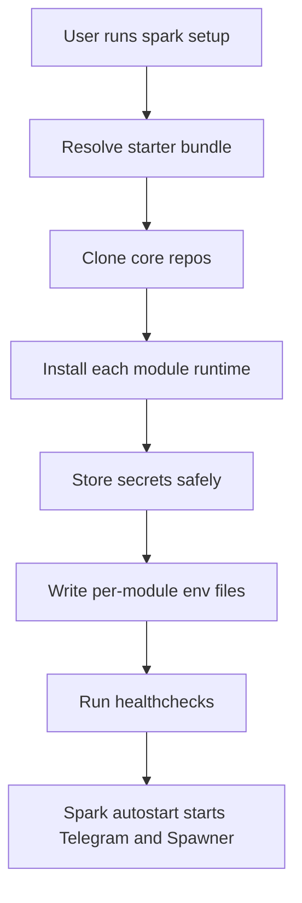
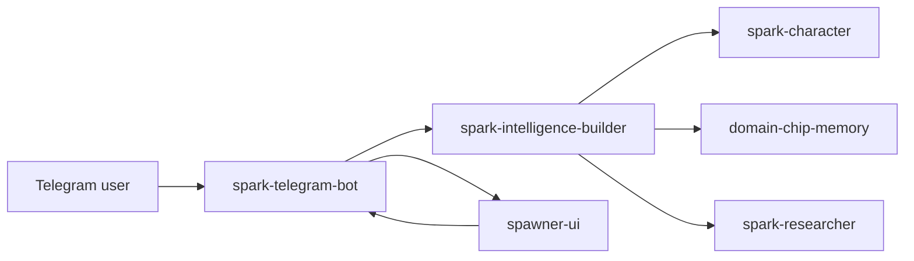

# spark-cli

Local installer and operator CLI for the Spark module ecosystem. A single setup command installs the starter stack, stores secrets, wires module env, runs healthchecks, and keeps long-running modules under supervision.

The public launch stack is documented in [docs/SPARK_ECOSYSTEM_LAUNCH.md](./docs/SPARK_ECOSYSTEM_LAUNCH.md).

## Quick Start

On any machine with Python 3.11+ and git on PATH:

```bash
git clone https://github.com/vibeforge1111/spark-cli
cd spark-cli
pip install -e .

spark setup
spark autostart install --now
spark status
```

That default setup installs:

- `spark-researcher`
- `spark-character`
- `spark-intelligence-builder`
- `domain-chip-memory`
- `spawner-ui`
- `spark-telegram-bot`

If another `spark` binary is already on your PATH, use `spark-local`. The package exposes both names to the same entrypoint.

## What Spark CLI Does

Spark CLI is the installer and operator shell for the Spark ecosystem. It gives a normal user one path instead of several separate repo installs.



The CLI owns:

- module discovery and install records
- safe secret storage
- generated module env files
- managed Python/Node runtime shims where needed
- healthchecks, logs, start/stop, and update flows

The CLI does not own:

- Telegram bot behavior
- Builder memory policy
- Spawner mission execution
- domain-chip benchmark logic

## Requirements

| Dependency | Why |
|---|---|
| Python 3.11+ | The CLI itself |
| `git` on PATH | To clone git-sourced modules and pull updates |
| OS keychain | Windows Credential Manager, macOS Keychain, or libsecret for `storage = "keychain"` secrets. Falls back to a mode-0600 file when no keychain is available. |

Per-module runtimes are declared in each module's `spark.toml`. The installer checks runtime constraints before running install commands. Pass `--skip-runtime-check` only for sandbox smoke tests.

## Install The CLI

Recommended macOS/Linux/WSL install. The shell installer auto-detects Apple Silicon, Intel Mac, Linux x64, Linux arm64, and WSL before downloading the managed Node runtime:

```bash
curl -fsSLO https://raw.githubusercontent.com/vibeforge1111/spark-cli/master/scripts/install.sh
less install.sh
bash ./install.sh
```

Recommended Windows PowerShell install:

```powershell
iwr https://raw.githubusercontent.com/vibeforge1111/spark-cli/master/scripts/install.ps1 -OutFile .\install.ps1
Get-Content .\install.ps1
powershell -ExecutionPolicy Bypass -File .\install.ps1
```

Windows scripted setup can pass the normal onboarding values directly to the installer:

```powershell
powershell -ExecutionPolicy Bypass -File .\install.ps1 `
  -NonInteractiveSetup `
  -BotToken $env:TELEGRAM_BOT_TOKEN `
  -AdminTelegramIds $env:TELEGRAM_ADMIN_IDS `
  -LlmProvider openai
```

The Windows installer adds `~\.spark\bin` to your user PATH so a new CMD or PowerShell can run `spark status` directly. If the current terminal still finds another `spark.exe`, reopen it or use the direct wrapper path: `%USERPROFILE%\.spark\bin\spark.cmd status`.

The launch docs intentionally avoid piping remote scripts directly into a shell. The installer also verifies the managed Node archive against Node's published `SHASUMS256.txt` before extraction.
If a good Node/npm is already installed, the installer uses it to avoid a slow first-run download; pass `-ManagedNode` on Windows or `--managed-node` on macOS/Linux to force Spark's verified managed Node runtime.
Before deploying installer changes, verify the committed script manifest locally with `spark verify --installers`. After deploying `agent.sparkswarm.ai`, run `spark verify --installers --hosted-installers` to catch stale hosted copies.

After setup, the macOS/Linux/WSL installer runs `spark autostart install --now` by default. That starts the Telegram starter stack immediately and installs the operating-system login hook so Spark comes back after the computer logs in. Use `--no-autostart` or `SPARK_AUTOSTART=0` if you only want to install/configure and start Spark manually later.

For scripted setup:

```bash
bash ./install.sh \
  --non-interactive-setup \
  --bot-token "$TELEGRAM_BOT_TOKEN" \
  --admin-telegram-ids "$TELEGRAM_ADMIN_IDS"
```

That command installs and wires the starter stack, but it intentionally does not invent an LLM provider. If no provider is chosen, `spark status` and `spark fix telegram` report the LLM roles as not configured instead of silently falling back to a local model.

To wire LLMs during setup, run interactive `spark setup` and choose from the provider menu. The wizard first asks for Telegram/BotFather values, then asks which LLM provider should power Spark, then only asks for the key that provider actually needs. You can keep one provider for all roles or split chat, Builder, memory, and mission work during the same flow.

Spark supports the same onboarding shape on Windows, macOS, Linux, and WSL:

```bash
bash ./install.sh \
  --non-interactive-setup \
  --bot-token "$TELEGRAM_BOT_TOKEN" \
  --admin-telegram-ids "$TELEGRAM_ADMIN_IDS" \
  --llm-provider openai
```

Provider options:

| Provider | Good first path | Key-based path |
|---|---|---|
| OpenAI | Sign in with `codex`, then run `spark setup --llm-provider openai` | `spark setup --llm-provider openai --openai-api-key <OPENAI_API_KEY>` |
| Codex CLI | Sign in with `codex`, then run `spark setup --llm-provider codex` | Uses the signed-in Codex CLI, no API key flag |
| Anthropic | Sign in with `claude`, then run `spark setup --llm-provider anthropic` | `spark setup --llm-provider anthropic --anthropic-api-key <ANTHROPIC_API_KEY>` |
| Z.AI / GLM | Use the coding endpoint key | `spark setup --llm-provider zai --zai-api-key <ZAI_API_KEY>` |
| MiniMax | Use a MiniMax API key | `spark setup --llm-provider minimax --minimax-api-key <MINIMAX_API_KEY>` |
| Ollama | Start Ollama locally | `spark setup --llm-provider ollama --ollama-url http://localhost:11434 --ollama-model <MODEL>` |

If your terminal will not paste secrets, copy the key normally and type `@clipboard` instead of the key:

```bash
spark setup --llm-provider zai --zai-api-key @clipboard --resume
```

The same shortcut works for BotFather tokens and generic secrets, for example `spark setup --bot-token @clipboard --resume`.
If a shell cannot paste secrets cleanly, put the value in an environment variable and reference it without printing it:

```bash
spark setup --bot-token @env:TELEGRAM_BOT_TOKEN --admin-telegram-ids "$TELEGRAM_ADMIN_IDS"
```

Rerunning setup is meant to be a fast configuration refresh. If the starter stack is already installed, `spark setup --resume` reuses the installed modules and skips `pip`/`npm` dependency commands by default, so your terminal stays responsive. To intentionally repair or reinstall dependencies, run:

```bash
spark setup --resume --run-install-commands
```

For more control, set separate providers for Spark's roles:

```bash
spark setup \
  --chat-llm-provider openai \
  --builder-llm-provider openai \
  --memory-llm-provider ollama \
  --mission-llm-provider minimax
```

`--llm-provider` remains the simple default for all roles. The role-specific flags override it when you want, for example, a local model for memory and a stronger cloud model for Builder or mission work.

If the Telegram bot is quiet after install, run the targeted repair checklist:

```bash
spark fix telegram
```

It checks the starter install, Telegram module health, BotFather token, admin allowlist, Builder bridge, LLM roles, supervised process state, and the next log/status commands to run.

### Named Telegram Bot Profiles

You can run more than one Telegram bot on the same Spark install for QA, practice, or separate surfaces. Do not start the old direct Builder gateway for this; every live bot should run through `spark-telegram-bot` so conversation, memory suppression, Builder, and Spawner behavior stays consistent.

```bash
spark setup --profile qa-bot --bot-token @clipboard --admin-telegram-ids <YOUR_TELEGRAM_ID>
spark start spark-telegram-bot --profile qa-bot
spark logs spark-telegram-bot --profile qa-bot
```

Profile setup creates a separate generated env file, local relay port, pid, and log file for the extra bot. Profiles share the same Builder home, memory chip, LLM role configuration, and Spawner UI by default.

`spark status` marks the primary bot profile and manual profiles. Spark AGI should be the primary profile for the main bot. Secondary tester profiles should stay manual unless you intentionally want them to autostart.

For a fuller launch-readiness proof, run:

```bash
spark verify
```

It checks the starter bundle, module healthchecks, LLM roles, Telegram long-polling/security, Builder memory + Researcher wiring, Spawner mission relay, and whether the Telegram bot plus Spawner UI are actually running.

For a live write/read proof that Builder can reach `domain-chip-memory`, run:

```bash
spark verify --deep
```

Deep verification runs Builder's direct memory smoke test with cleanup, so a setup agent can distinguish "memory is installed" from "memory is actually wired."

To inspect only LLM choices and role readiness:

```bash
spark providers list
spark providers status
```

## Default Starter Bundle

`spark setup` defaults to the blessed `telegram-starter` bundle.

The runtime shape is:



Setup writes the shared env that makes the pieces talk to each other:

- Telegram gets the bot token and admin IDs.
- Telegram uses long polling for this launch.
- Telegram and Spawner both get a generated `TELEGRAM_RELAY_SECRET`.
- Telegram and Spawner share the mission relay URL.
- Telegram receives `SPARK_BUILDER_HOME`, `SPARK_BUILDER_REPO`, and `SPARK_BUILDER_BRIDGE_MODE=required`, so memory commands go through Builder instead of a local no-op adapter.
- Telegram, Spawner, and Builder get selected non-secret LLM provider metadata for chat, builder, memory, and mission roles.
- Builder is initialized with `spark-character`, memory enabled, `shadow_mode=false`, `domain-chip-memory` active, and `spark-researcher` connected.
- Cloud API keys are stored through Spark's secret backend and are not written into generated module env files. OpenAI can also use a signed-in Codex CLI, and Anthropic can use Claude Code, when those CLIs are installed and signed in.

The older dashboard/resonance API is intentionally not part of the launch starter path. Fresh installs should not require `SPARK_API_URL`, `SPARK_DASHBOARD_URL`, or a local service on port `8787`.

## After Install

For a fresh user, the intended path is:

```bash
spark guide
spark status
spark verify
spark verify --deep
spark fix telegram
spark providers status
spark autostart install --now
```

That installs the operating-system login hook and starts the local Spark stack immediately. After that, rebooting or logging back into the computer should bring the Telegram agent back without opening a terminal. Manual fallback:

```bash
spark start telegram-starter
```

Then open Telegram and talk to the bot configured during `spark setup`.

Useful Telegram checks:

- `/start` shows the available commands.
- `/myid` prints the numeric Telegram ID to put in `ADMIN_TELEGRAM_IDS`.
- `/diagnose` checks LLM/provider paths.
- `/remember my preferred Spark reply style is concise but warm` should return a short saved confirmation, not an internal `Working Memory` heading.
- `/run <goal>` sends a mission to Spawner UI.

If the bot does not reply, run `spark fix telegram` first. It is the fastest path to tell whether the issue is token/admin setup, LLM provider setup, Builder bridge wiring, or the local process not running.

## Agent Operating Guide

If you are an LLM agent installing Spark for a user:

1. Prefer the official site/script path the user gives you, or clone `spark-cli` directly if developing locally.
2. Run `spark setup` first; do not install the core repos one by one unless debugging.
3. Use `spark status --json` before declaring the install healthy, and check that the LLM role summary matches the user's intended chat, builder, memory, and mission providers.
4. Run `spark verify` before declaring the install launch-ready, and `spark verify --deep` before declaring memory wired.
5. If the bot is quiet, run `spark fix telegram` before editing code.
6. Never print or commit bot tokens, provider API keys, `.env`, `.env.*`, or `~/.spark/config/secrets.local.json`.
7. Confirm Telegram's generated env points at Builder with `SPARK_BUILDER_HOME`, and confirm Builder has memory enabled with `domain-chip-memory` active.
8. If `/remember` replies with `Working Memory`, generic memory text, or a false success while recall fails, rerun `spark setup`, restart `spark-telegram-bot`, then inspect Builder memory state before editing bot code. The launch starter should fail visibly if Builder is unreachable, not silently fall back.
9. If a module fails healthcheck, read `spark status` repair hints before editing code.
10. Do not add the deferred dashboard/port `8787` path back into launch onboarding.

## Commands

Use `spark <cmd> --help` for full flags.

| Command | What it does |
|---|---|
| `spark list` | List discoverable modules |
| `spark init <name>` | Scaffold a new module |
| `spark install <target>` | Install by registry name, bundle, local path, or git URL |
| `spark setup [bundle]` | Interactive preflight and secret prompts for a bundle; defaults to `telegram-starter` |
| `spark setup --profile <name>` | Add a named Telegram bot profile |
| `spark update [target]` | Re-run install commands and pull managed git clones |
| `spark uninstall [target]` | Stop, remove generated env, delete clone, and rotate secrets |
| `spark start [target]` | Topological launch using `needs.modules` order |
| `spark start spark-telegram-bot --profile <name>` | Start one named Telegram bot profile |
| `spark stop [target]` | Reverse-topological stop |
| `spark autostart install --now` | Start Spark now and automatically at computer login |
| `spark autostart status` | Show whether the login hook is installed |
| `spark autostart uninstall` | Remove the login hook |
| `spark status [--json]` | Run module healthchecks with repair hints |
| `spark doctor [--json]` | Diagnostic variant of status |
| `spark logs <module>` | Tail `~/.spark/logs/<module>/process.log` |
| `spark search [query]` | Browse the registry |
| `spark secrets list|set|get|delete` | Keychain-backed secret store |
| `spark config get|set|unset|list` | User config at `~/.spark/config/config.json` |

## State Layout

The CLI owns everything under `~/.spark/`:

```text
~/.spark/
|-- state/
|   |-- installed.json
|   |-- setup.json
|   |-- pids.json
|   `-- install_progress.json
|-- config/
|   |-- config.json
|   |-- modules/<name>.env
|   |-- secrets_index.json
|   `-- secrets.local.json
|-- modules/<name>/source/
`-- logs/<name>/process.log
```

## Development

```bash
pip install -e .
pip install pytest
python -m pytest tests/ -q
```

Current focused suite lives in `tests/test_cli.py`.

## More Docs

- [docs/SPARK_ECOSYSTEM_LAUNCH.md](./docs/SPARK_ECOSYSTEM_LAUNCH.md) - public launch contract
- [docs/SPARK_NORMIE_ONBOARDING_AND_GATEWAY_TEST.md](./docs/SPARK_NORMIE_ONBOARDING_AND_GATEWAY_TEST.md) - step-by-step install and real-time Telegram gateway test
- [docs/LAUNCH_RUNBOOK.md](./docs/LAUNCH_RUNBOOK.md) - release-day verification
- [docs/LAUNCH_SECURITY_AUDIT_2026-04-24.md](./docs/LAUNCH_SECURITY_AUDIT_2026-04-24.md) - launch security audit
- [SECURITY.md](./SECURITY.md) - secret and launch security notes

## License

MIT. See [LICENSE](./LICENSE).
