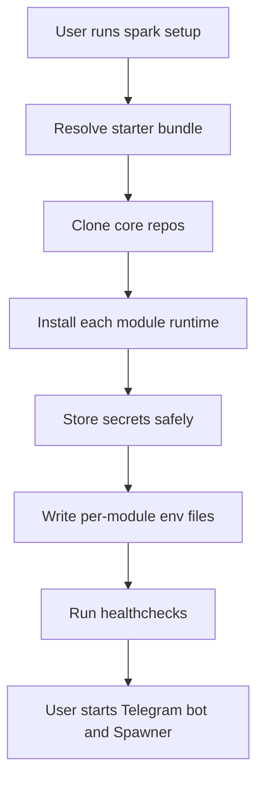
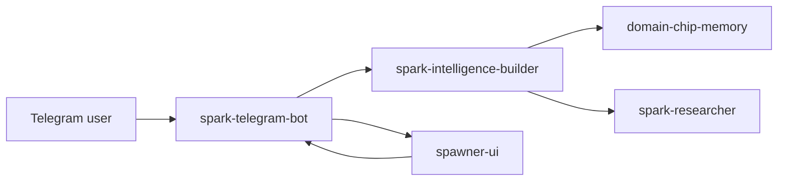

# spark-cli

Local installer and operator CLI for the Spark module ecosystem. A single setup command installs the starter stack, stores secrets, wires module env, runs healthchecks, and keeps long-running modules under supervision.

The public launch stack is documented in [docs/SPARK_ECOSYSTEM_LAUNCH.md](./docs/SPARK_ECOSYSTEM_LAUNCH.md).

## Quick Start

On any machine with Python 3.11+ and git on PATH:

```bash
git clone https://github.com/vibeforge1111/spark-cli
cd spark-cli
pip install -e .

spark setup
spark start spark-telegram-bot
spark status
```

That default setup installs:

- `spark-researcher`
- `spark-intelligence-builder`
- `domain-chip-memory`
- `spawner-ui`
- `spark-telegram-bot`

If another `spark` binary is already on your PATH, use `spark-local`. The package exposes both names to the same entrypoint.

## What Spark CLI Does

Spark CLI is the installer and operator shell for the Spark ecosystem. It gives a normal user one path instead of five separate repo installs.



The CLI owns:

- module discovery and install records
- safe secret storage
- generated module env files
- managed Python/Node runtime shims where needed
- healthchecks, logs, start/stop, and update flows

The CLI does not own:

- Telegram bot behavior
- Builder memory policy
- Spawner mission execution
- domain-chip benchmark logic

## Requirements

| Dependency | Why |
|---|---|
| Python 3.11+ | The CLI itself |
| `git` on PATH | To clone git-sourced modules and pull updates |
| OS keychain | Windows Credential Manager, macOS Keychain, or libsecret for `storage = "keychain"` secrets. Falls back to a mode-0600 file when no keychain is available. |

Per-module runtimes are declared in each module's `spark.toml`. The installer checks runtime constraints before running install commands. Pass `--skip-runtime-check` only for sandbox smoke tests.

## Install The CLI

Recommended macOS/Linux/WSL install. The shell installer auto-detects Apple Silicon, Intel Mac, Linux x64, Linux arm64, and WSL before downloading the managed Node runtime:

```bash
curl -fsSLO https://raw.githubusercontent.com/vibeforge1111/spark-cli/master/scripts/install.sh
less install.sh
bash ./install.sh
```

Recommended Windows PowerShell install:

```powershell
iwr https://raw.githubusercontent.com/vibeforge1111/spark-cli/master/scripts/install.ps1 -OutFile .\install.ps1
Get-Content .\install.ps1
powershell -ExecutionPolicy Bypass -File .\install.ps1
```

The launch docs intentionally avoid piping remote scripts directly into a shell. The installer also verifies the managed Node archive against Node's published `SHASUMS256.txt` before extraction.

For scripted setup:

```bash
bash ./install.sh \
  --setup-arg --non-interactive \
  --setup-arg --bot-token \
  --setup-arg "$TELEGRAM_BOT_TOKEN" \
  --setup-arg --admin-telegram-ids \
  --setup-arg "$TELEGRAM_ADMIN_IDS"
```

To wire a cloud LLM during setup, pass the provider and key. For the Z.AI GLM coding endpoint:

```bash
bash ./install.sh \
  --setup-arg --non-interactive \
  --setup-arg --bot-token \
  --setup-arg "$TELEGRAM_BOT_TOKEN" \
  --setup-arg --admin-telegram-ids \
  --setup-arg "$TELEGRAM_ADMIN_IDS" \
  --setup-arg --llm-provider \
  --setup-arg zai \
  --setup-arg --zai-api-key \
  --setup-arg "$ZAI_API_KEY"
```

## Default Starter Bundle

`spark setup` defaults to the blessed `telegram-starter` bundle.

The runtime shape is:



Setup writes the shared env that makes the pieces talk to each other:

- Telegram gets the bot token and admin IDs.
- Telegram uses long polling for this launch.
- Telegram and Spawner both get a generated `TELEGRAM_RELAY_SECRET`.
- Telegram and Spawner share the mission relay URL.
- Telegram, Spawner, and Builder get selected non-secret LLM provider metadata.
- Cloud API keys are stored through Spark's secret backend.

The older dashboard/resonance API is intentionally not part of the launch starter path. Fresh installs should not require `SPARK_API_URL`, `SPARK_DASHBOARD_URL`, or a local service on port `8787`.

## After Install

For a fresh user, the intended path is:

```bash
spark guide
spark status
spark start spawner-ui
spark start spark-telegram-bot
```

Then open Telegram and talk to the bot configured during `spark setup`.

Useful Telegram checks:

- `/start` shows the available commands.
- `/myid` prints the numeric Telegram ID to put in `ADMIN_TELEGRAM_IDS`.
- `/diagnose` checks LLM/provider paths.
- `/run <goal>` sends a mission to Spawner UI.

## Agent Operating Guide

If you are an LLM agent installing Spark for a user:

1. Prefer the official site/script path the user gives you, or clone `spark-cli` directly if developing locally.
2. Run `spark setup` first; do not install the five core repos one by one unless debugging.
3. Use `spark status --json` before declaring the install healthy.
4. Never print or commit bot tokens, provider API keys, `.env`, `.env.*`, or `~/.spark/config/secrets.local.json`.
5. If a module fails healthcheck, read `spark status` repair hints before editing code.
6. Do not add the deferred dashboard/port `8787` path back into launch onboarding.

## Commands

Use `spark <cmd> --help` for full flags.

| Command | What it does |
|---|---|
| `spark list` | List discoverable modules |
| `spark init <name>` | Scaffold a new module |
| `spark install <target>` | Install by registry name, bundle, local path, or git URL |
| `spark setup [bundle]` | Interactive preflight and secret prompts for a bundle; defaults to `telegram-starter` |
| `spark update [target]` | Re-run install commands and pull managed git clones |
| `spark uninstall [target]` | Stop, remove generated env, delete clone, and rotate secrets |
| `spark start [target]` | Topological launch using `needs.modules` order |
| `spark stop [target]` | Reverse-topological stop |
| `spark status [--json]` | Run module healthchecks with repair hints |
| `spark doctor [--json]` | Diagnostic variant of status |
| `spark logs <module>` | Tail `~/.spark/logs/<module>/process.log` |
| `spark search [query]` | Browse the registry |
| `spark secrets list|set|get|delete` | Keychain-backed secret store |
| `spark config get|set|unset|list` | User config at `~/.spark/config/config.json` |

## State Layout

The CLI owns everything under `~/.spark/`:

```text
~/.spark/
|-- state/
|   |-- installed.json
|   |-- setup.json
|   |-- pids.json
|   `-- install_progress.json
|-- config/
|   |-- config.json
|   |-- modules/<name>.env
|   |-- secrets_index.json
|   `-- secrets.local.json
|-- modules/<name>/source/
`-- logs/<name>/process.log
```

## Development

```bash
pip install -e .
pip install pytest
python -m pytest tests/ -q
```

Current focused suite lives in `tests/test_cli.py`.

## More Docs

- [docs/SPARK_ECOSYSTEM_LAUNCH.md](./docs/SPARK_ECOSYSTEM_LAUNCH.md) - public launch contract
- [docs/SPARK_NORMIE_ONBOARDING_AND_GATEWAY_TEST.md](./docs/SPARK_NORMIE_ONBOARDING_AND_GATEWAY_TEST.md) - step-by-step install and real-time Telegram gateway test
- [docs/LAUNCH_RUNBOOK.md](./docs/LAUNCH_RUNBOOK.md) - release-day verification
- [docs/LAUNCH_SECURITY_AUDIT_2026-04-24.md](./docs/LAUNCH_SECURITY_AUDIT_2026-04-24.md) - launch security audit
- [SECURITY.md](./SECURITY.md) - secret and launch security notes

## License

MIT. See [LICENSE](./LICENSE).
