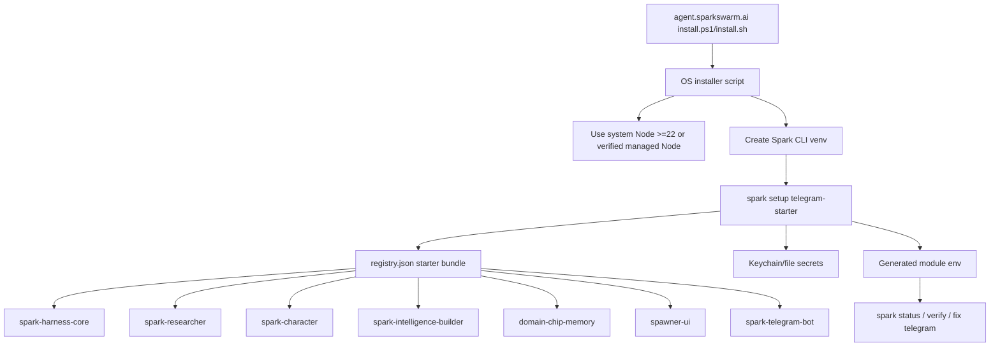

# Spark Production Installer Audit - 2026-04-25

> Superseded for the 2026-06-10 Harness Core installer lane: `telegram-starter` now installs `spark-harness-core` first, and the full proof lane is `spark-cli` plus 10 registry-pinned runtime/support modules. Keep this audit as historical context for the April launch flow.

This audit covers the launch-day Spark onboarding path:

1. hosted installer from `agent.sparkswarm.ai`
2. `spark-cli` installer scripts
3. `spark setup` and generated module env
4. starter bundle manifests
5. runtime health/status/repair loop

The goal is to keep the first public install boring: one installer, one setup flow, one configured Telegram agent, one LLM provider path, and clear repair commands when a local machine differs from ours.

## Current Launch Flow

## What We Are Actually Using

The current `telegram-starter` stack installs Harness Core first, then the starter runtime modules:

1. `spark-harness-core`
2. `spark-researcher`
3. `spark-character`
4. `spark-intelligence-builder`
5. `domain-chip-memory`
6. `spawner-ui`
7. `spark-telegram-bot`

Installer-side responsibilities:

- `scripts/install.ps1` and `scripts/install.sh` install the CLI into a prefix.
- Both installers now prefer an existing Node/npm when Node is already new enough, and fall back to a checksum-verified managed Node runtime.
- Both installers run `spark setup telegram-starter` unless skipped.
- Windows now has first-class setup flags such as `-BotToken`, `-AdminTelegramIds`, `-LlmProvider`, and provider key flags.
- macOS/Linux/WSL now has matching `--bot-token`, `--admin-telegram-ids`, `--llm-provider`, and provider key flags.

CLI-side responsibilities:

- Resolve the starter bundle from `registry.json`.
- Clone/discover module repos.
- Validate `spark.toml` manifests.
- Run install commands for fresh modules.
- Reuse installed modules on `spark setup --resume`, unless `--run-install-commands` is explicitly passed.
- Store keychain-backed secrets outside generated env.
- Generate module env files that connect Telegram, Builder, Character, Memory, Spawner, Researcher, and LLM roles.
- Provide `spark status`, `spark verify`, `spark fix telegram`, and logs as repair surfaces.

## Fixed During This Audit

### 1. Optional `langchain-openai` Broke `domain-chip-memory`

`domain-chip-memory` had `dependencies = []` but imported `langchain_openai.ChatOpenAI` at module import time in `beam_official_eval.py`.

Impact:

- A normal memory install could fail on machines without `langchain-openai`, even though the dependency is only needed for the optional BEAM official upstream evaluator.
- This matches the MacBook failure report.

Fix:

- Moved `langchain_openai` loading behind `_load_chat_openai()`.
- Runtime memory/CLI import no longer requires `langchain-openai`.
- BEAM official eval now fails with a direct message telling the user to install `langchain-openai`.
- Added a unit test proving the missing optional dependency is explained cleanly.

### 2. Manifest Homepage Drift

Several manifests still pointed at placeholder `github.com/spark/...` homes while the real repos live under `vibeforge1111`.

Impact:

- Confusing trust boundary during install/review.
- Makes support and agent troubleshooting harder.

Fix:

- Updated `spark-intelligence-builder/spark.toml`.
- Updated `spark-telegram-bot/spark.toml`.
- Updated `spawner-ui/spark.toml`.
- Validated all four changed manifests through `spark_cli.cli.validate_manifest_schema()`.

## Spaghetti And Risk Areas

### P0/P1 Launch Risks

1. **Installer copies live in two places.**
   - Source of truth is `spark-cli/scripts`.
   - Hosted site has static copies at `spark-agent-site/install.ps1` and `spark-agent-site/install.sh`.
   - Risk: fixes land in `spark-cli` but public users still download stale site files.
   - Current mitigation: synced and redeployed site after installer changes.
   - Next hardening: make the site serve installer scripts directly from pinned `spark-cli` release artifacts or CI-sync them automatically.

2. **`spark setup` has too many responsibilities.**
   - It resolves modules, prompts for secrets, configures LLM roles, runs installs, writes setup state, initializes Builder runtime, persists secrets, and writes env.
   - Risk: a small setup UX fix can accidentally affect install side effects.
   - Current mitigation: focused unit tests around prompt reuse, setup defaults, install-command skipping, and installer script contracts.
   - Next hardening: split setup into internal phases: `resolve`, `collect_config`, `install_dependencies`, `write_runtime`, `postflight`.

3. **Shell installer still supports legacy raw arg escape hatches.**
   - `install.sh` keeps `SPARK_SETUP_ARGS` and `--setup-arg` for advanced users.
   - Risk: string-splitting in shell can surprise users if values contain spaces or shell metacharacters.
   - Current mitigation: official docs use direct flags now.
   - Next hardening: deprecate `SPARK_SETUP_ARGS` from docs and prefer repeated `--setup-arg` or first-class flags only.

4. **Health can be green at module level while the whole user journey is not ready.**
   - Example: Telegram can be configured while Spawner is not running.
   - Current mitigation: `spark status` reports dependency blocking and `spark verify` has deeper checks.
   - Next hardening: make installer postflight run `spark verify --quick` after autostart, and show a one-screen pass/fail summary.

### P2 Maintainability Risks

1. **Provider configuration is duplicated across setup wizard, installer flags, docs, status repair hints, and generated env.**
   - Next hardening: centralize provider flag metadata so installers/docs can be generated or checked from the same contract.

2. **Manifests and registry overlap.**
   - Registry has source URLs and summaries; manifests have homepage and capabilities.
   - Next hardening: add a unit test that registry source and manifest homepage agree for blessed modules.

3. **Temp/sandbox installs can pollute local state if scripts are not careful.**
   - Windows installer now avoids persistent PATH updates under `%TEMP%`.
   - Next hardening: add a sandbox smoke script that asserts no temp prefix is left in user PATH.

4. **Docs still contain older launch learnings mixed with current contract.**
   - Next hardening: separate user-facing docs from internal launch notes and keep the public README short.

## Recommended Next Fixes

1. Add a `spark doctor install` command that checks:
   - current `spark` resolution
   - live Spark home
   - module source URLs
   - stale temp prefixes in PATH
   - whether hosted installer hash matches the current `spark-cli` script hash

2. Add a registry-to-manifest consistency test in `spark-cli`.

3. Move setup internals into smaller functions while preserving CLI behavior.

4. Add a public installer CI check:
   - download `https://agent.sparkswarm.ai/install.ps1`
   - download raw GitHub `scripts/install.ps1`
   - compare expected feature markers or hashes after deploy

5. Add a real fresh-prefix smoke that runs:
   - install CLI
   - setup with fake tokens and `--skip-install-commands`
   - `spark status --json`
   - assert all starter modules are registered and LLM roles are configured

## Current Test Evidence

- `domain-chip-memory`: focused optional dependency tests passed.
- `spark-cli`: Windows and WSL full suites passed after latest installer changes.
- Hosted installer was verified after Railway deploy to include:
  - first-class Windows setup flags
  - system Node reuse
  - hardened public installer hash
